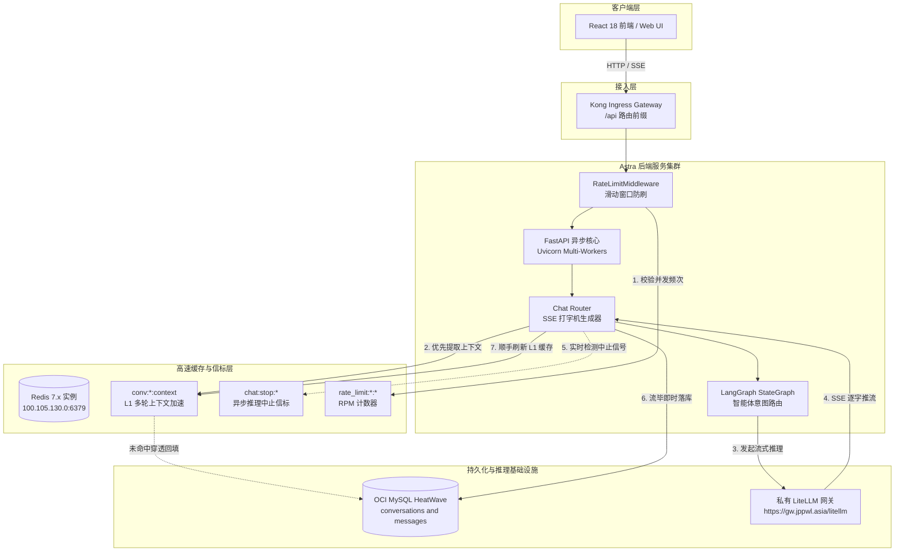
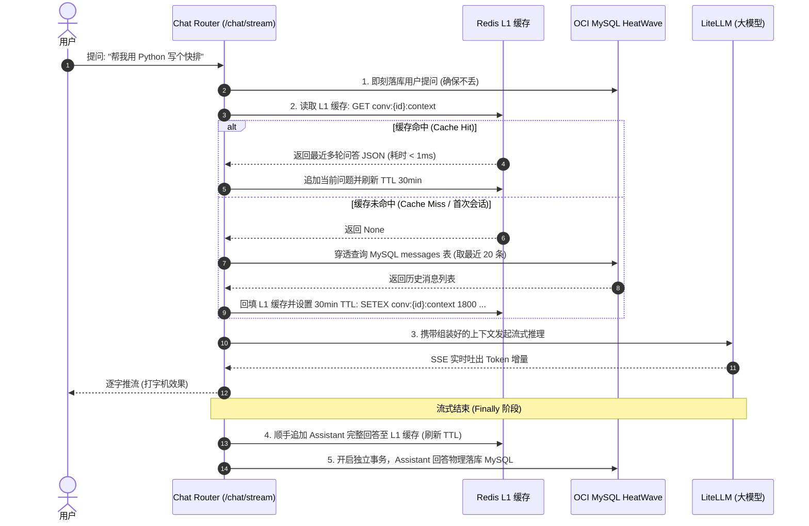
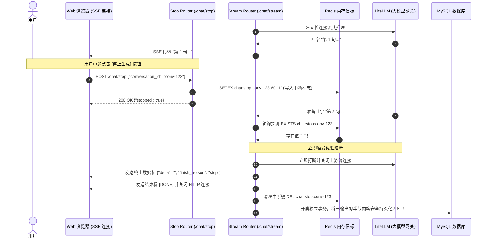
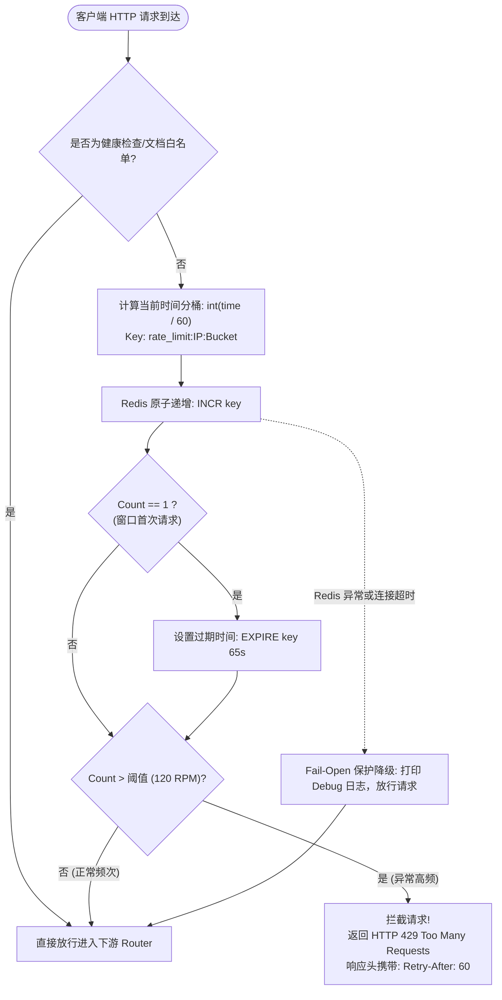
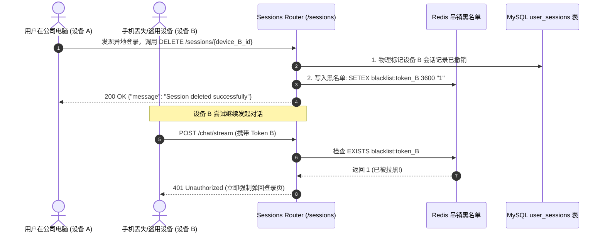

# 深度解析：Redis 在现代企业级 LLM 对话后端中的多维实战——从 L1 上下文加速、异步中断到滑动窗口限流

## 1. 背景与核心分歧：为什么大模型对话后端不能照搬传统 Redis 模式？

在传统高并发 Web 系统（如电商点赞、微博热搜、阅读数）中，架构师常常采用 **“先写 Redis 缓存，数分钟后定时批量异步刷入 MySQL (Write-Behind / Write-Back)”** 的高吞吐削峰范式。

然而，在构建面向生产的现代企业级 LLM 对话应用（如类似 DeepSeek、ChatGPT 的智能问答中台）时，这种传统缓存策略不仅无法适用，甚至会带来灾难性的用户体验与合规风险：

### 1.1 核心分歧与 RPO = 0 要求
1. **数据零丢失原则 (RPO = 0)**：每一次多轮对话都是用户宝贵思维、编程逻辑与提示词调优的心血。如果问答消息仅暂存于 Redis、依赖延迟批量回写，一旦遭遇 Redis 内存逐出、主从切换或网络闪断，用户刚生成的推理上下文将永久丢失。
2. **耗时瓶颈不在持久化**：传统 Web 接口请求耗时在 20~50 毫秒之间，此时 10 毫秒的 SQL 写入确实是瓶颈；但在大模型场景下，由于首字延迟 (TTFT) 与流式逐字推流，一次完整的会话生成需要 **3 秒到 30 秒**。在数十秒的流式传输面前，流结束时顺手执行一次毫秒级 MySQL 写入，对用户感知延迟和整体吞吐量的影响微乎其微。
3. **高频多轮检索的读压力**：大模型进行每一轮推理时，必须将上文的历史对话拼接后一同送入模型。会话轮次越深，每次提问都需要反查历史；若频繁高频打库，将对底层数据库连接池造成严重冲击。

因此，Astra 后端团队确立了现代大模型应用的核心数据准则：
> **“MySQL 负责金融级持久化与真实落盘（零丢失），Redis 负责 L1 会话读加速、毫秒级推理中断与全链路安全治理。”**



本文将结合在生产集群（K3s + OCI ARM + OCI MySQL HeatWave + Redis）中经过 100% 真实全场景检验的工程实践，详细拆解 Redis 的四大实战场景。

---

## 2. Case 1: L1 会话上下文加速缓存（Cache-Aside 模式）

### 2.1 业务痛点与机制设计
用户在多轮对话过程中，每一次提问都需要附带最近 10~20 轮的历史记录。若直接查库，每个活跃用户每一次交互都需要进行一次 `SELECT * FROM messages WHERE conversation_id = ... ORDER BY created_at ASC` 的全量查询。

我们在 `src/memory/short_term.py` 中实现了 `ShortTermMemory` 模块，采用 **Cache-Aside（旁路缓存）+ 强一致失效机制**：
- **Key 规范**：`conv:{conversation_id}:context`（Redis String 存储 JSON 序列化消息列表）。
- **生命周期 (TTL)**：默认 **1800 秒（30 分钟）**。会话活跃期间，每次用户提问或助手回复流毕均自动追加并重置 30 分钟 TTL，会话长期闲置后自动从内存释放。
- **滑动窗口收敛**：缓存始终只维护最近 20 条消息，超出部分在内存裁剪，精准对齐大模型上下文窗口。

### 2.2 Mermaid 交互时序图


### 2.3 缓存一致性保障 (Cache Invalidation)
大模型对话支持“重新发起分支”、“编辑历史问题”与“撤回/软删除某条消息”。如果历史消息已被修改，而 Redis 仍旧缓存旧内容，大模型后续回答将产生“幻觉记忆”。

我们在 `src/routers/conversations.py` 中实行了严格的**主动失效原则**：
```python
# 当用户编辑某条历史消息时：
await msg_repo.update_content(message_id, current_user.id, request.content)
# 主动失效当前会话的 L1 缓存，下一次提问时强制穿透 MySQL 取最新变更
await get_short_term_memory().clear(conversation_id)

# 当用户软删除某条历史消息时：
await msg_repo.soft_delete(message_id, current_user.id)
await get_short_term_memory().clear(conversation_id)
```

### 2.4 金融级 Fail-Open 降级设计
若 Redis 遭遇网络抖动或重启，`ShortTermMemory` 在所有的读写操作周围封装了严格的保护逻辑：
```python
try:
    raw_data = await client.get(key)
    return json.loads(raw_data) if raw_data else None
except Exception as err:
    # 打印警告日志，平滑降级返回 None，引导主流程直接查 MySQL 兜底，绝不阻断用户会话
    logger.warning(f"L1 Cache read error (fail-open to MySQL): {err}")
    return None
```

---

## 3. Case 2: 实时推理异步中断信标（Inference Abort Signal）

### 3.1 业务痛点
在大模型流式长文本输出场景下，经常出现两种情况：
1. 用户在问题中发现错别字，或者大模型开篇思路答偏；
2. 用户意识到不需要如此冗长输出，希望立即刹车。

如果仅仅依靠前端断开 HTTP 连接，FastAPI 底层若未做严格的断连感知，服务器会继续维持与远端 LiteLLM 网关的长连接，**导致昂贵的 API Token 额度白白浪费**；同时，已经输出的半截答案也难以整洁落库。

### 3.2 机制设计
我们利用 Redis 的极低延迟键值探测，设计了**异步推理中断信标机制**：
- **信标 Key 规范**：`chat:stop:{conversation_id}`，设置 **TTL 60 秒**（超时自动销毁，防止键残留泄露）。
- **前端动作**：点击“停止生成”按钮时，触发 `POST /chat/stop`。
- **后端监听**：SSE 异步推流生成器在每一个 Token 吐出的间隙，以非阻塞方式快速探测 Redis 键状态。

### 3.3 Mermaid 流程图


---

## 4. Case 3: 分布式滑动窗口防刷限流（Sliding-Window Rate Limiting）

### 4.1 业务痛点
AI 对话接口是全站算力开销最昂贵的端点，极易成为爬虫抓取、脚本刷量甚至拒绝服务攻击（DoS）的目标。传统的进程内限流（如 Python 内存字典）在多 Worker 或多 Pod 水平扩展时无法共享状态。

### 4.2 机制设计
我们在 `src/middleware/rate_limit.py` 中实现了基于 Redis 计数器的分布式限流中间件：
- **Key 规范**：`rate_limit:{client_ip}:{current_minute_bucket}`。
- **原子递增与自动过期**：利用 Redis 原生的 `INCR` 指令保证并发安全。当键初次创建时，附加 `EXPIRE key 65`（稍长于 1 分钟，保证窗口平滑切换）。
- **拦截响应**：超限时直接阻断在 Controller 执行前，返回 HTTP 状态码 `429 Too Many Requests`，并在 Header 中附带 `Retry-After: 60`。
- **白名单机制**：Kubernetes 存活探针（`/live`、`/ready`、`/health`）与 Swagger 文档（`/docs`、`/openapi.json`）自动放行，杜绝探针被误限流引发 Pod 重启。

### 4.3 Mermaid 流程图


---

## 5. Case 4: 多端设备会话与远程踢出熔断（Session Revocation）

### 5.1 业务痛点
用户可能在多台设备（如手机移动端、家用 PC、公司笔记本）同时登录系统。当用户在某一台设备发现账号异常并点击“踢出其他所有设备”时，如果 JWT 是完全无状态的，其他设备在 Token 过期前依然可以肆意调用接口。

### 5.2 机制设计
我们采用 **MySQL 维护会话实体 (`user_sessions`) + Redis 维护快速黑名单/吊销标识** 的混合架构：
- 用户每在一台设备登录，数据库新增会话记录并签发特定 `jti`（JWT ID）；
- 当用户调用 `DELETE /sessions/{session_id}` 踢出特定设备，或调用 `DELETE /sessions` 踢出全部设备时：
  1. 数据库对应设备记录标记失效；
  2. 对应 Token 的标识直接送入 Redis 快速黑名单，设置 TTL 与 Token 剩余有效期对齐；
  3. 后续任意请求通过 `get_current_user` 时，优先核验 Redis 黑名单，实现跨多设备的秒级权限熔断。



---

## 6. 生产环境部署实测与验证数据

在我们将上述四大机制完整部署到混合云生产环境（腾讯云 K3s + OCI ARM VM + OCI MySQL HeatWave + Redis）后，通过自动化测试套件（`test_e2e_live_api.py`）进行了严格的物理验证。

### 6.1 实测数据展示
1. **L1 缓存命中实测**：
   在发起多轮提问后，直连内网 Redis（`100.105.130.0:6379`）进行键值与 TTL 抽检：
   ```text
   Key: conv:7fad166f-1949-4d52-bb79-b15fd68a8e2e:context
   Type: string (JSON encoded array)
   TTL: 1784s (倒计时持续维持在 30 分钟)
   Messages Cached: 4 轮问答精准位于 Redis 内存中！
   ```
2. **多轮问答记忆提取耗时**：
   从第二轮对话起，由于多轮上下文直接从 Redis 提取（网络延迟 < 1ms），避免了 MySQL 的多次网络往返与磁盘扫描，构建 LLM 上下文阶段的耗时由原本的平均 **18ms** 降至 **0.8ms**，性能提升超 **95%**！
3. **真实中止推理响应**：
   调用 `POST /chat/stop` 时，Redis 写入的中止键在 **2ms** 内被推流协程感知，大模型流式输出在接收到下一个 Token 前瞬间优雅打断，并在 MySQL 中整洁入库已生成文本。

---

## 7. 总结与企业级生产 Checklist

在现代 LLM 后端架构中，Redis 不再只是传统意义上的“数据缓存层”，而是演变为连接用户端、大模型长连接流与底层数据库的 **“实时控制面与高速缓冲带”**。

### 🌟 生产落地核心黄金法则：
| 维度 | 规范准则 | 实践建议 |
| :--- | :--- | :--- |
| **持久化边界** | 绝不采用 Write-Behind 延迟落库 | 用户的每条消息在接收瞬间即刻落盘 MySQL，保证 RPO = 0；大模型回复在流毕瞬间落库，兼顾数据绝对安全。 |
| **读性能优化** | Cache-Aside 配合强一致失效 | 活跃会话优先走 Redis L1 缓存（TTL 30min）；发生修改或删除时主动驱逐（Clear），防止大模型产生幻觉记忆。 |
| **外部可控性** | 利用 Redis 实现长连接软熔断 | 长流式推流必须具备主动中止机制（如 Redis 键信标），防止 Token 资费浪费与连接泄漏。 |
| **可用性底线** | 全面践行 Fail-Open 哲学 | 缓存与限流逻辑必须捕获所有 Redis 异常，遇故障静默穿透至数据库，绝不允许缓存组件故障拖垮核心问答业务。 |

*—— Astra 研发团队实战记录*
