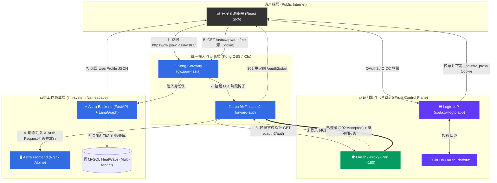
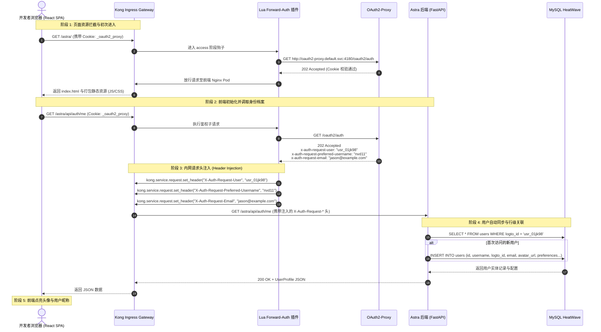

# 深入浅出网关鉴权：Kong Forward-Auth 零信任身份注入 vs 传统前端 OAuth2 JWT 架构全方位对比与实战

> **作者**: Jason (Wenlin Pan)  
> **环境**: Kubernetes (K3s) + Kong Ingress Controller 3.x (OSS) + OAuth2-Proxy + Logto (GitHub OAuth)  
> **核心组件**: Astra Frontend (React 18 + Vite SPA) + Astra Backend (FastAPI + SQLAlchemy)  
> **技术领域**: 云原生网关架构、Zero-Trust 安全、身份鉴权体系、全栈多租户数据隔离  

---

## 1. 背景与核心问题：前端从哪拿到“我是谁”？

在现代 Web 与 AI 全栈系统（如大模型智能体平台 Astra、模型网关 LiteLLM、数据库管理平台 DbGate）的开发中，身份认证（Authentication）与用户画像获取（Identity & Profile Provisioning）是系统生命周期的第一道大门。

在传统的单页应用（SPA）中，最普遍的做法是：
> 前端通过 OAuth2 Authorization Code + PKCE 流程跳转 IdP，回调换取 Access Token (JWT) 与 Refresh Token，保存在浏览器的 `localStorage` 或内存中，后续每次发请求时在 HTTP Header 中手动附带 `Authorization: Bearer <JWT>`。

然而，在我们基于 **Kong Ingress Controller (OSS)**、**OAuth2-Proxy** 和 **Logto (GitHub OAuth)** 搭建的集群生产环境中，整个身份流转却呈现出完全不同的格局：
**前端 JavaScript 既没有存储任何 JWT 令牌，也没有在请求中手动附带 `Bearer` 头，但当用户打开网页并发起请求时，后端 FastAPI 却能精准无误地获取用户的 GitHub ID、用户名和邮箱，并完成租户级数据隔离。**

这就引出了一系列极具深度且常被开发者混淆的核心问题：
1. **浏览器里没有传 JWT，后端到底是怎么知道“当前请求属于哪个用户”的？**
2. **既然 Kong 网关已经掌握了用户信息，为什么不直接在网关层给前端页面，还要让前端单独调用一次后端的 `/auth/me` 接口？**
3. **这种“网关层 Forward-Auth 注入”模式，与传统“前端保管 JWT Token”模式相比，究竟有哪些根本性的架构优劣与安全边界差异？**

本文将结合生产集群的真实落地实践，为您彻底拆解这套优雅的零信任网关身份体系。

---

## 2. 架构全景：Kong Forward-Auth 的端到端时序

### 2.1 整体网络拓扑

集群内部的统一鉴权网格由 **Kong Gateway** 作为流量守门人，配合轻量级认证代理 **OAuth2-Proxy** 以及基于 OIDC 的 **Logto** 统一身份中心协同运作：



### 2.2 真实请求的全时序流转

整个鉴权过程对终端用户而言完全无感，核心分为以下五个阶段：



---

## 3. 核心机制揭秘：后端如何凭借“空气”拿到用户信息？

### 3.1 关键所在：Kong 网关的内网 Header 注入

客户端发出的原始 HTTP 请求中，只包含由 OAuth2-Proxy 在用户登录成功后下发至根域 `.jppwl.asia` 的加密 Cookie：
```http
GET /astra/api/auth/me HTTP/2
Host: gw.jppwl.asia
Cookie: _oauth2_proxy=Q1RBVE...;
Accept: application/json
```
**在这个请求离开浏览器时，里面绝对没有任何诸如 `nvd11`、`user_id` 等明文用户字段。**

当请求抵达 Kong 网关时，集群部署的自定义 Lua 插件 `oauth2-forward-auth`（源码片段如下）开始介入：

```lua
-- 向内部 OAuth2-Proxy 发起轻量鉴权探针
local res, err = httpc:request_uri("http://oauth2-proxy.default.svc.cluster.local:4180/oauth2/auth", {
  method = "GET",
  headers = fwd_headers,
})

-- 校验通过 (200 OK 或 202 Accepted)
if res.status == 200 or res.status == 202 then
  -- 将 OAuth2-Proxy 返回的所有 x-auth-request-* 响应头，
  -- 转化为发往下游 Pod 的 HTTP 请求头！
  for hname, hval in pairs(res.headers) do
    if hname:lower():find("^x%-auth%-request%-") then
      kong.service.request.set_header(hname, hval)
    end
  end
  return
end
```

### 3.2 下游 Pod 真正接收到的 HTTP 请求

经过 Kong 网关处理后，实际发给 `astra-backend` Pod 的请求已经被网关“掉包/增强”为：

```http
GET /astra/api/auth/me HTTP/1.1
Host: astra-backend:8000
Cookie: _oauth2_proxy=Q1RBVE...
X-Auth-Request-User: usr_01jkyz87x
X-Auth-Request-Preferred-Username: nvd11
X-Auth-Request-Email: jason@example.com
X-Auth-Request-Access-Token: eyJhbGciOiJ...
```

因此，后端的 FastAPI 代码根本不需要去解密 Cookie 或校验 JWT 签名，而是直接从安全内网的请求头中提取：

```python
async def _get_user_from_forward_auth(
    request: Request,
    db: AsyncSession,
) -> User:
    # 1. 直接读取 Kong 网关注入的安全头
    sso_id = request.headers.get("X-Auth-Request-User")
    username = request.headers.get("X-Auth-Request-Preferred-Username") or "github-user"
    email = request.headers.get("X-Auth-Request-Email")
    
    if not sso_id:
        raise HTTPException(status_code=401, detail="Missing SSO identity headers")

    # 2. 数据库自动同步与落库 (保障强租户隔离)
    user_repo = UserRepository(db)
    user = await user_repo.get_or_create_by_sso(
        sso_id=sso_id,
        username=username,
        email=email,
        avatar_url=f"https://github.com/{username}.png",
    )
    return user
```

---

## 4. 灵魂拷问：既然网关有 Header，为什么前端 UI 不能直接读，非要通过后端？

这是许多工程师在设计网关时最容易产生的误区：“网关既然都知道用户名了，为什么不直接给页面，省得前端再去调用一次 `/auth/me`？”

答案包含 **2 个前端浏览器的物理限制** 和 **1 个业务层面的刚性要求**：

### 4.1 物理限制一：浏览器 JS 无法读取页面本身的 Request Headers
当浏览器访问 `https://gw.jppwl.asia/astra/` 获取 HTML 时：
- Kong 把 `X-Auth-Request-User` 头加在了**发给 Nginx 的请求（Request）** 上；
- Nginx 收到请求后，把磁盘上的 `index.html` 作为**响应（Response）** 吐回给浏览器；
- 浏览器在内存中运行编译好的 React JS。根据 W3C 与浏览器安全沙箱规范，**运行中的客户端 JavaScript 没有任何 API 能回溯读取“加载当前 HTML 网页时服务端收到的请求头”**。

### 4.2 物理限制二：静态 SPA 架构 vs 动态 SSR 模板
- 如果是古老的 PHP/JSP，或者 Next.js / Nuxt 这种服务端渲染（SSR）框架，Node.js 服务端在拼接 HTML 字符串时，可以把 Header 里的 `username` 拼进模板；
- 但 Astra 前端是标准的 **Vite + React 纯静态单页应用（SPA）**，部署在轻量的 Alpine Nginx 镜像中，Nginx 只是单纯的文件搬运工，不可能去动态篡改静态 JS/HTML 内容。

### 4.3 业务刚需：多租户系统必须在后端完成“建档与偏好合并”
就算前端通过某种奇巧淫技拿到了 `nvd11` 这个名字，**后端交互仍然无法省略**：
1. **自动建档与多设备绑定**：
   网关只负责证明“你是合法的 GitHub 用户”，但系统中的会话表（`conversations`）、消息表（`messages`）都需要强外键关联到本地 MySQL 的 `users.id`。必须由后端执行 `INSERT IGNORE` 或更新最新登录时间、登记当前 IP 与设备会话（`user_sessions`）；
2. **应用级偏好配置获取**：
   网关绝不可能知道用户上次偏好的默认大模型是 `gemini-3.8-flash` 还是 `deepseek-v4`，也不可能知道用户最近修改的 Agent 路由规则。这些属于**业务应用状态**，必须通过后端的 `/auth/me` 统一返回完整的 `UserProfile`。

---

## 5. 架构大对决：Kong Forward-Auth vs 传统前端 OAuth2 JWT

为了更直观地对比两种架构的优劣，我们从安全、性能、维护成本和跨服务能力进行全方位横评：

| 评估维度 | 传统前端 OAuth2 JWT 模式 | Kong Forward-Auth 零信任网关模式 (当前落地) |
|---|---|---|
| **令牌存储位置** | 浏览器 `localStorage` / `sessionStorage` / JS 内存 | **前端零存储**。仅在浏览器存 `HttpOnly; Secure; Domain=.jppwl.asia` Cookie |
| **XSS 攻击防护** | **极脆弱**。任何注入的第三方脚本均可一键读取 `localStorage` 盗走 JWT 冒充用户 | **绝对免疫**。Cookie 具备 `HttpOnly` 标志，JS 引擎物理无法读取，恶意脚本偷不走凭据 |
| **外部伪造防御** | 后端每个微服务必须独立装配 JWKS 验签逻辑，密钥泄露则全盘沦陷 | **网关边界隔离**。外部伪造的 `X-Auth-Request-*` 会被网关强制覆盖，内网 Pod 只信任网关输入 |
| **前端工程复杂度** | **极高**。前端需编写：<br>1. PKCE 状态机与回调跳转<br>2. Axios 401 拦截器<br>3. Refresh Token 并发刷新锁队列<br>4. 令牌持久化与过期计算 | **极简 (接近为 0)**。<br>1. 无需任何 Token 存取代码<br>2. 401 时仅需一行 `window.location.href = '/oauth2/start'`<br>3. 登出仅需一行 `window.location.href = '/oauth2/sign_out'` |
| **跨微服务 SSO** | 极度繁琐。每个前端应用必须各自完成一次授权或跨域共享 Token，容易遭遇 CORS 拦截 | **全站原生单点通用**。因为 Cookie 挂载在根域 `.jppwl.asia`，登录过 LiteLLM UI 或 DbGate 后，打开 Astra 立即处于已登录态 |
| **会话即时撤销 (Revocation)** | **几乎不可能即时吊销**。无状态 JWT 在 Expire 之前无法作废，必须引入全局 Redis 黑名单机制增加复杂度 | **秒级下线**。在 OAuth2-Proxy 或 IdP 端注销会话后，网关在下次探针（3秒缓存）时立刻返回 401 阻断请求 |
| **微服务解耦度** | 每个后端服务都需要依赖 JWT 库、JWKS 公钥拉取客户端、解析中间件 | 业务 Pod 彻底纯净化，只需从 HTTP Header 读取字符串，完全解耦 OIDC/OAuth 细节 |

---

## 6. 生产落地最佳实践与避坑指南

在实际部署这一套体系时，有三个核心安全与配置红线必须死守：

### 6.1 红线一：防止外部恶意伪造（Header Spoofing）
如果某个恶意用户直接在外部 `curl` 时带上：
```bash
curl -H "X-Auth-Request-User: admin" https://gw.jppwl.asia/astra/api/...
```
后端是否会被欺骗？
**答案是：绝不能！**
- 在 Kong Gateway 的 Lua 插件中，进入 `access` 阶段的第一步必须**无条件清空**来自客户端的同名 Header：
  ```lua
  kong.service.request.clear_header("X-Auth-Request-User")
  kong.service.request.clear_header("X-Auth-Request-Preferred-Username")
  kong.service.request.clear_header("X-Auth-Request-Email")
  ```
- 只有当 `OAuth2-Proxy` 探针返回 202 校验成功后，由网关显式注入的值才会生效，彻底封死头伪造漏洞。

### 6.2 红线二：AJAX 异步请求与网页导航的精准分流
当用户的登录 Cookie 过期时：
- 如果用户在浏览器地址栏敲回车（`Accept: text/html`），网关应该返回 **302 Redirect**，跳转到 Logto 登录页；
- 但如果页面已经加载完成，前端 React 正在后台 `fetch('/astra/api/chat')`（`Accept: application/json`），网关如果返回 302，前端的 Fetch API 会尝试跨域重定向至 IdP，触发复杂的 CORS 报错，导致控制台崩溃且无法正常跳转！
- **解法**：在 Lua 插件中通过 `Accept` 头精准分流：
  ```lua
  if res.status == 401 or res.status == 403 then
    local accept = (headers["accept"] or ""):lower()
    -- AJAX / JSON 请求直接响应 401 JSON，供前端拦截器优雅感知
    if accept:find("application/json") then
      return kong.response.exit(401, { message = "Unauthorized: Session expired" })
    end
    -- 网页访问下发 302 重定向
    return kong.response.exit(302, nil, { ["Location"] = "/oauth2/start?rd=" .. req_uri })
  end
  ```

### 6.3 红线三：开发与离线环境的平滑降级
在本地单机调试或运行 CI 自动化单元测试时，开发者本地通常不会启动整套 Kong + OAuth2-Proxy。
后端架构必须支持根据环境变量平滑切换：
```bash
# 本地开发或 CI 测试
APP_AUTH_ENABLED=false
# 此时后端自动注入默认的 anonymous 用户对象，测试用例无需模拟复杂的网关 Header 即可全绿运行。
```

---

## 7. 结语

通过采用 **Kong Gateway + OAuth2-Proxy + Logto (GitHub OAuth)** 的 Forward-Auth 架构：
1. 我们让前端摆脱了动辄数百行、脆弱且容易招致 XSS 的 Token 存取与刷新逻辑，回归到了最纯粹、最轻量化的状态；
2. 实现了与团队内部已有工具链（LiteLLM 模型看板、DbGate 数据终端）的一站式全域单点登录（SSO）；
3. 后端服务在零信任安全边界内，依托内网 Header 注入完成行级隔离与自动同步，既保证了架构的极致优雅，又实现了金融级的访问安全性。

这套架构模式，正是云原生与零信任（Zero Trust）理念在企业级全栈系统落地中的经典范式。
